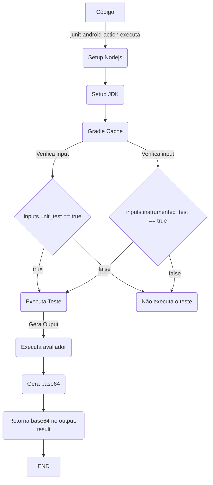

# 🤖 JUnit Android Evaluator [](https://github.com/betrybe/junit-android-evaluator/actions/workflows/main.yml)

Projeto em javascript responsável por processar os relatórios(xml) de testes unitários e instrumentados.


## Inputs

  - `unit_test`: Variável responsável por determinar  a execução dos testes unitários. **`default: true`**
  - `instrumented_test`:  Variável responsável por determinar a execução dos testes instrumentados. **`default: false`**
  - `pr_author_username`: Nome do autor do pull request.

## Output 
  - ```result```
  Resultado em base 64 originário do arquivo JSON gerado apartir da execução dos testes em JUnit.

## Configurando seu projeto para utilizar o avaliador 

Para utilizar esta action é necessário adicionar ao ***.github/workflows/main.yml*** o seguinte trecho.
```yml
on:
  pull_request:
    types: [opened, synchronize]

jobs:
  Tests:
    runs-on: macos-latest
    steps:
      - name: checkout
        uses: actions/checkout@v3

      - name: Fetch JUnit Android Evaluator
        uses: actions/checkout@v3
        with:
          repository: betrybe/junit-android-evaluator
          ref: v1
          token: ${{ secrets.GIT_HUB_PAT }}
          path: .github/actions/junit-android-evaluator

      - name: Run JUnit Android Evaluator
        uses: ./.github/actions/junit-android-evaluator
        with:
          pr_author_username: ${{ github.event.pull_request.user.login }}
```
Para habilitar ou desabilitar a execução de um tipo de teste, basta passar via parâmetro no passo da execução do avaliador.
```yml
  - name: Run JUnit Android Evaluator
    uses: ./.github/actions/junit-android-evaluator
    with:
      pr_author_username: ${{ github.event.pull_request.user.login }}
      unit_test: false
      instrumented_test: true
```


## Build

Para não ter que rodar o `npm install` na execução da action, usamos o `vercel/ncc` para compilar o projeto em um único arquivo na pasta `dist`.
```bash
ncc build index.js --license licenses.txt
```


## Fluxo de execução

